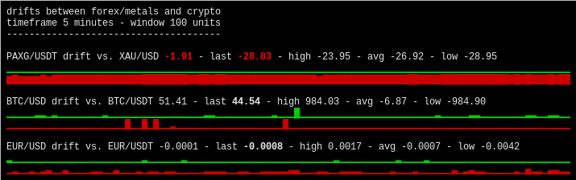

# paxg-arbitrage

_trading bot for handling XAU vs. PAXG drifts_

## warning

this is not high frequency trading, we simply grab the rates online every 5 minutes to compare forex / metal pairs against their crypto equivalent.

## requirements

KSH93 (not PDKSH nor MKSH) and the `mail` command

	apt install ksh bsd-mailx

## architecture

quick & dirty: stdout of the compare rate scripts are written to data/ as text.
yet the script itself reads values from that output.

## setup

	cp -pi drift.conf.sample drift.conf
	vi drift.conf

	# binance hmac
	apikey=...

	...

## variables

e.g. for PAXG vs. XAU, we consider XAU to be leading and PAXG to be following

- hence the "drift" concerns PAXG: positive if PAXG lives above XAU and negative if PAXG lives below XAU
- the "drift average" is the average of the last 100 units (one unit is 5 minutes according to the crontab setup below)
- the "drift variability" (actual current drift) is how much the drift differs from its 100 units average
- the "drift volatility" is how powerful the drift variability is compared to the drift average, in percent

## usage

### test run

	./compare-pairs
	tail -F $HOME/dev/paxg-arbitrage/data/*.txt

### enable

	crontab -e

	*/5 * * * *     $HOME/dev/paxg-arbitrage/compare-pairs

## visualization

_as root_

	#wget https://git.zx2c4.com/spark/plain/spark.c
	gcc spark.c -o spark -lm
	mv spark /usr/local/bin/

_as user_

	cd $HOME/dev/paxg-arbitrage/compare-pairs/
<!-- terminal issues, doesn't print the bars right
	screen -S drift
-->
	ls -lhF data/*.txt
	./drift.ksh

## resources

https://www.tradingview.com/symbols/XAUUSD/

https://www.tradingview.com/symbols/PAXGUSDT/

https://github.com/binance/binance-spot-api-docs/blob/master/faqs/trailing-stop-faq.md

<!--
https://github.com/xdec/gold-price-api

https://github.com/yueow/xau-broadcast/tree/master/xaubroadcast

goldapi.io/dashboard

https://stackoverflow.com/questions/44604440/forex-historical-data-in-python

https://stackoverflow.com/questions/28164849/using-jq-to-parse-and-display-multiple-fields-in-a-json-serially
-->

